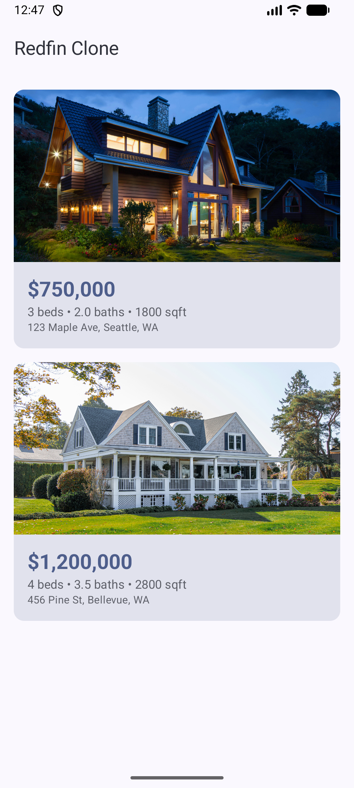
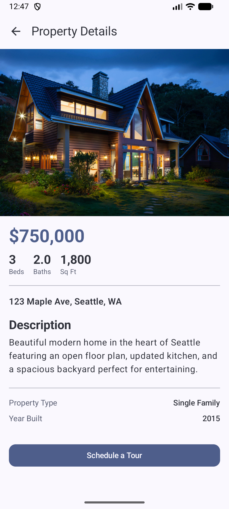

# RedfinApp

A real estate application demo inspired by Redfin, showcasing modern Android development practices with Jetpack Compose.

## Screenshots

  
  

## Features

- **Property Listings**: Browse a collection of available properties with key details like price, beds, and baths.
- **Property Details**: In-depth view of each property, including descriptions, specifications, and high-quality imagery.
- **Modern Navigation**: Seamless transitions between screens using Jetpack Compose Navigation.
- **Responsive UI**: Built entirely with Jetpack Compose for a modern and fluid user experience.

## Tech Stack

- **Language**: [Kotlin](https://kotlinlang.org/)
- **UI Framework**: [Jetpack Compose](https://developer.android.com/jetpack/compose)
- **Dependency Injection**: [Koin](https://insert-koin.io/)
- **Image Loading**: [Coil](https://coil-kt.github.io/coil/)
- **Asynchronous Programming**: [Kotlin Coroutines & Flow](https://kotlinlang.org/docs/coroutines-overview.html)
- **Navigation**: [Compose Navigation](https://developer.android.com/jetpack/compose/navigation)
- **Local Data/Networking**: Room and Retrofit (configured for future integration)

## Architecture

The project follows the recommended Android Architecture components:
- **MVVM Pattern**: Separation of concerns between UI, State, and Data.
- **Repository Pattern**: Centralized data access logic.
- **Clean UI State**: ViewModels expose state to Compose screens.

## Project Structure

- `ui/`: Contains Compose screens, ViewModels, and navigation logic.
- `data/`: Handles data operations and includes models and repository implementations.
- `di/`: Koin modules for dependency injection.
- `theme/`: Material3 theme configuration.
